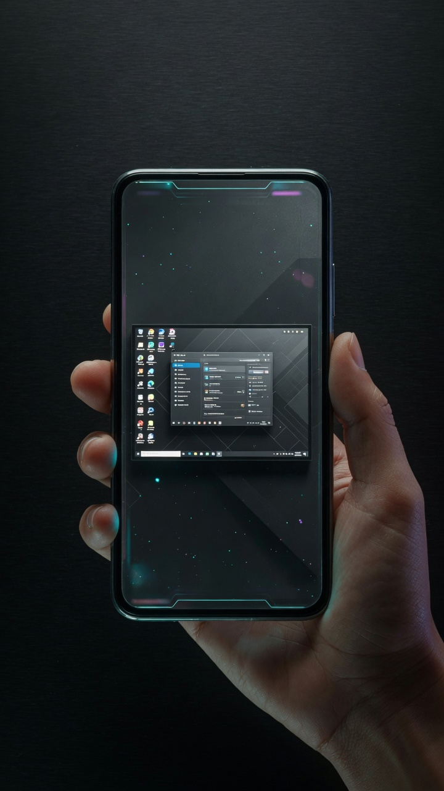
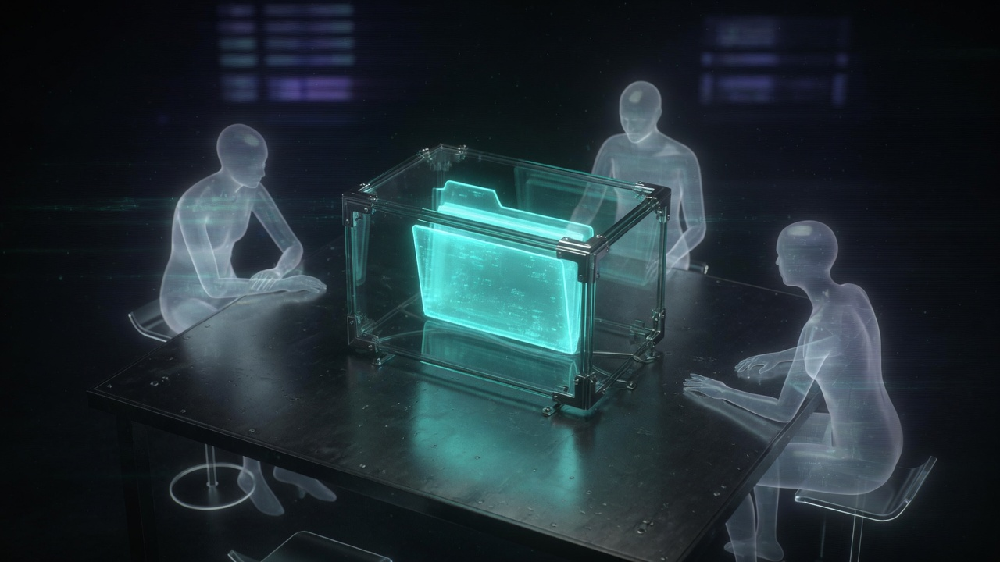

<p align="center">
  
</p>

<h1 align="center">POCKET</h1>

<p align="center">
  <strong>Your computer. Your agents. Your phone as the kernel.</strong><br/>
  Native Agent OS — desk · PhoneAI · Portal · team workspaces · MCP — on this PC.
</p>

<p align="center">
  <a href="https://github.com/ItsNotAILABS/pocket"></a>
  
  
</p>

<p align="center">
  <video src="docs/brand/hero-desk.mp4" poster="docs/brand/hero-desk.jpg" width="100%" autoplay loop muted playsinline controls></video>
</p>

<p align="center">
  
</p>

<p align="center">
  <a href="http://127.0.0.1:8787/desk">Open Desk</a> ·
  <a href="http://127.0.0.1:8787/phoneai">PhoneAI</a> ·
  <a href="http://127.0.0.1:8787/phoneai/portal">Portal</a> ·
  <a href="http://127.0.0.1:8787/v1/auth/desktop/enter">Sign in on this PC</a>
</p>

---

## What it is

POCKET is not a chat tab. It is the **host** that seats agents on your machine, puts a **phone kernel** on that same host, and streams the real desktop into a glass you can touch.

Agents think first. They use at most one tool. Long work lives in a **tenant-jailed team folder**, not in the chat transcript. KEEP dies with the session. The team room does not.

| You open | You get |
|---|---|
| **Desk** | Codex, Grok, and ready engines — advertised only when they are actually on the host |
| **PhoneAI Kernel** | A phone OS seat on this PC, not a receptionist |
| **Portal** | One primary screen. Touch maps to the real mouse. No recursive nested desktops |
| **Team workspace** | Founder-only. Canonical path under `~/.pocket/tenants/<you>/teams/<id>/` |
| **MCP** | Agents call tools. You do not open extra studio tabs for them |

---

## Product film

<table>
<tr>
<td width="50%" valign="top">
  <video src="docs/brand/phone-kernel.mp4" poster="docs/brand/phone-kernel.jpg" width="100%" autoplay loop muted playsinline controls></video>
  <p align="center"></p>
  <p align="center"><b>PhoneAI Kernel</b><br/>The computer, contained in the glass.</p>
</td>
<td width="50%" valign="top">
  <video src="docs/brand/team-workspace.mp4" poster="docs/brand/team-workspace.jpg" width="100%" autoplay loop muted playsinline controls></video>
  <p align="center"></p>
  <p align="center"><b>Team workspace</b><br/>Shared disk. Jailed. Bound to you.</p>
</td>
</tr>
</table>

<p align="center">
  
</p>

Stills are generated product frames. Loops are 6-second cinematic moves from those frames (`docs/brand/`).

---

## Open it on this PC

```text
http://127.0.0.1:8787/v1/auth/desktop/enter
http://127.0.0.1:8787/desk
http://127.0.0.1:8787/phoneai
http://127.0.0.1:8787/phoneai/portal
```

```text
GET /health
GET /v1/ready
GET /v1/catalog
GET /v1/protocols/screen-family
```

`GET /v1/phoneai/sessions` mints a Pocket or PhoneAI session.

Windows desktop build:

```powershell
.\scripts\Build-POCKET-Desktop-Exe.ps1 -Arch auto
```

---

## Why operators pick it

**One identity, one route, one harness.** Not a pile of extra agents.

**The phone is a kernel seat** on the operator PC. Portal streams one primary screen. Touch is an exact mouse, contained — not a stretched rectangle.

**Studios are agent tools**, not extra screens.

**Market seats cannot walk the founder disk.** Team routes are founder-only. Paths canonicalize. `../escaped` is rejected. Jobs inherit the jailed cwd.

**Windows Copilot stays closed** unless you say `open copilot`. Lookup and scheduled work do not launch it because the prompt mentioned AI.

**Auro Endure is not learning.** Pocket will not say it is until native stateful evaluation exists.

---

## Now shipping (3.16.4)

- Tenant jail helpers bind every team path and job cwd
- Team worker ticks seats under the tenant root
- Endure worker queues cycles with `learning: false`
- MCP `team_*` / `endure_*` dispatch is first-class, not nested inside screen tools
- Catalog lists **ready** engines only
- SCREEN-KERNEL/1.1 + `pocket.stream.v1` + device pair across hostnames
- Product film in `docs/brand/` (generated stills + 6s loops)

Host-control policy: public HTTP is shells, health, and login. Portal cookies bind a principal. RAH execute needs a WorkGrant.

---

## Surfaces

| Surface | Path |
|---|---|
| Desk | `/desk` |
| PhoneAI | `/phoneai` · kernel `/phoneai/app` · OS `/phoneai/os` |
| Portal | `/phoneai/portal` |
| Antigravity (HWND app) | `/phoneai/anti` |
| Agent mail | `/mail` · `*@agents.pocket.local` |
| Work | `/work` |
| Docs | `/docs` |
| Install | `/install` · `python -m pocket install` |

Agent eyes: `GET /v1/eyes?which=portal` · MCP `eyes_see` / `eyes_touch`.

---

## Family

```text
POCKET host  ── identity, tenancy, policy, desk, PhoneAI, Portal
     │
     ├── POCKET Agent     long-running execution, RAH, receipts
     ├── Pocket Voice     turn-taking, studio, STT
     ├── PhoneAI          mobile kernel / PWA
     ├── vLaptop          SCREEN-KERNEL embody
     ├── NEXUS            federation
     ├── CAPSULA          isolated capsules
     └── MatDaemon        bounded compute
```

[POCKET Agent](https://github.com/ItsNotAILABS/pocket-agent) · [PhoneAI](https://github.com/ItsNotAILABS/PhoneAI) · [vLaptop](https://github.com/ItsNotAILABS/vlaptop) · [NEXUS](https://github.com/ItsNotAILABS/nexus)

Protocols: `pocket.stream.v1` · `SCREEN-KERNEL/1.1` · `pocket.device.pair.v1` · `pocket.team.workspace.v1` — spec in [`docs/POCKET_SCREEN_FAMILY_PROTOCOL.md`](docs/POCKET_SCREEN_FAMILY_PROTOCOL.md).

---

## Claims and marks

Invention claims (Alfredo Medina, ItsNotAI Labs): [001](docs/research/INVENTION_CLAIMS_2026.md) · [002](docs/research/INVENTION_CLAIMS_2026.002.md) · [trademark memo](docs/research/TRADEMARK_AND_PATENT_MEMO_2026.md). Live: `GET /v1/claims` · `GET /v1/marks`.

File marks: **PHONEAI KERNEL**, **POCKET HOST**, **VLAPTOP**, **SCREEN-KERNEL**. Do not brand PHONE.AI, FACE ID, ANTIGRAVITY, or WEBMCP as ours.

---

## Docs

| | |
|---|---|
| [`docs/INDEX.md`](docs/INDEX.md) | platform map |
| [`docs/HOW_TO.md`](docs/HOW_TO.md) | operator recipes |
| [`docs/INFRA.md`](docs/INFRA.md) | host map |
| [`docs/how-to/INSTALL.md`](docs/how-to/INSTALL.md) | install |
| [`SECURITY.md`](SECURITY.md) | security |
| [`ENTERPRISE.md`](ENTERPRISE.md) | tenancy |

Repository: https://github.com/ItsNotAILABS/pocket
