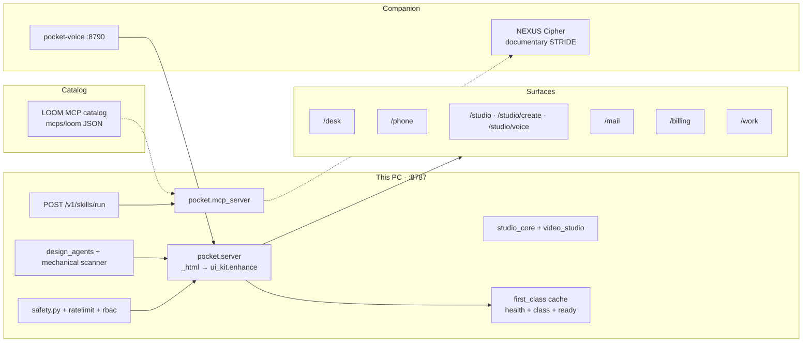
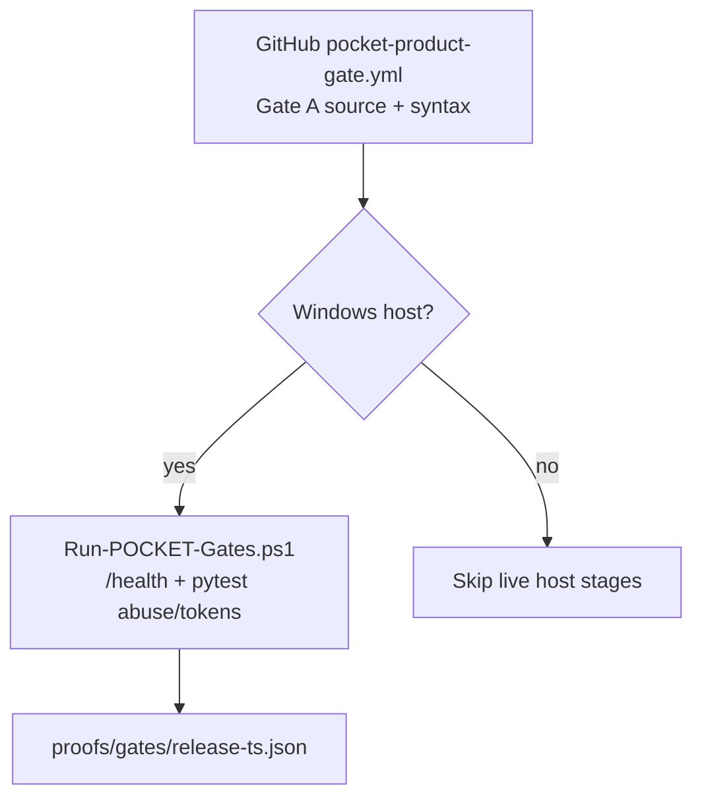
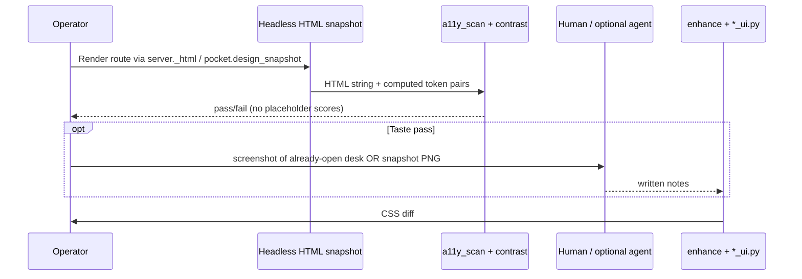
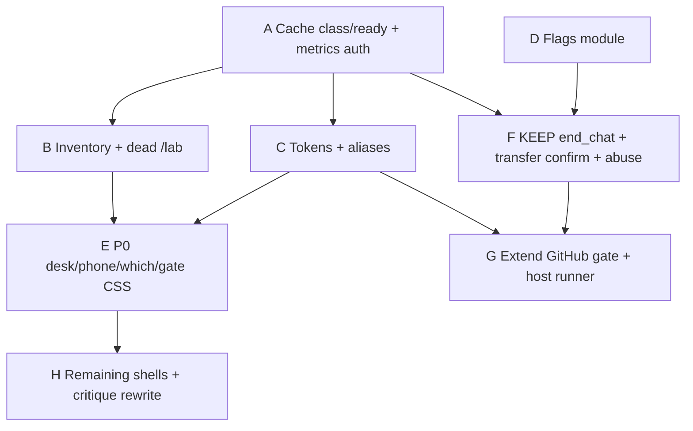

# POCKET Official Enterprise Pipeline + Design-System Polish

| Field | Value |
|-------|--------|
| **Document** | POCKET v3.7.0 — Official Enterprise SDLC / Launch Pipeline and Design-System Polish of Every Surface |
| **Author** | Founder / operator of this host (`ACCESS.txt` owner). Reviews and receipts are signed by this role, not a named hire. |
| **Date** | 2026-08-15 |
| **Rev** | 4 — operator approved full official bar (trains A–H); ToS remains operator-only |
| **Status** | Approved |
| **Product** | POCKET Native Agent OS v3.7.0 (`pocket.__version__`) |
| **Tagline** | "Native Agent OS — habitat · screen · studio · phone · MCP — on your computer." |
| **Live host** | `http://127.0.0.1:8787/` · LAN `http://192.168.12.127:8787/` · public `https://pocket.medinatechlabs.net` |
| **Source of truth** | `C:\Users\Medin\OneDrive\pocket-os` (package `pocket`) |
| **Host data** | `C:\Users\Medin\.pocket\` |
| **Companions** | NEXUS `C:\Users\Medin\OneDrive\nexus` (stdio MCP + Cipher). Voice `http://127.0.0.1:8790`. Imagine Studio `C:\Users\Medin\OneDrive\imagine-studio`. pocket-agent `C:\Users\Medin\OneDrive\pocket-agent`. |
| **LOOM** | `C:\Users\Medin\OneDrive\mcps\loom` is an **MCP tool catalog** (JSON), not a running sibling process like Voice. |

---

## Overview

POCKET is already a live first-class host (probed 2026-08-15). It is not a greenfield product. What it lacks is a **ship bar that this Windows host can fail-close**, plus a **single design system that actually restyles existing `var(--bg)` templates**.

This document maps POCKET onto fifteen gates, each marked **mechanical / documentary / human**. Implementation is **eight merge trains** against `pocket-os`. Reuse `/v1/*`, MCP skills, NEXUS Cipher (as a *packet generator*, not a fail-closed reviewer), and Product Studio. Do not invent a new product. Do not open the operator's signed-in Edge for design QA.

### Live probe (corrected)

| Endpoint | Result | Implication |
|----------|--------|-------------|
| `GET /health` | **68 ms**, 200, `version=3.7.0`, `heart=beating`, `heartbeat.interval_ms≈873` | Only cheap liveness signal today |
| `GET /v1/class` | **200 in ~19294 ms**, `grade=S`, `22/22`, `first_class=true` | Same expensive `fc_report()` as ready; **public** (`auth.path_is_public`) |
| `GET /v1/ready` | timed out at 8s client | `production.checklist()` already calls `fc_report()`, then the handler calls it **again** plus `health_domains()` + `api_catalog()` |

`first_class.py` comment: `score()/pillars() can take 10–15s and freezes the single-threaded host.` The serve loop is `ThreadingHTTPServer` (comment is stale) but the work is still **request-synchronous and DoS-able** from LAN/`0.0.0.0`. `/health` already uses `_HEALTH_CACHE` (90s TTL, background refresh via `health_enrichment()`). `/v1/class` and `/v1/ready` do **not**.

`pocket.platform_coherence.SURFACES` has **23** first-class domains (`loomgraph` … `mcp_cli`), not 26. `ui_kit` JS `SURFACES` has **19** cmdk rows (missing `/which` and `/tour`).

---

## Background & Motivation

### Current state (verified on this host)

| Fact | Evidence |
|------|----------|
| Product is live | `GET /health` 200 in 68 ms: `3.7.0`, `production=true`. Class/ready are **expensive**, not “healthy cheap gates.” |
| Doctrine is coded | `pocket.__init__.DOCTRINE` + `SURFACES` (23 ids). Desk tabs stay in-shell (`showAppTab`). |
| Shared but incomplete UI layer | `pocket.ui_kit` **Fluid 4.0.0** injects `/ui/kit.css` + `/ui/kit.js` via `server._html` → `enhance()`. Templates consume `--bg`, `--muted`, `--accent` — **not** `--pk-*`. Kit today only defines `--pk-ease` / `--pk-t` / `--pk-focus`. |
| Design agents exist as **template printers** | `design_agents._critique` fills rubric scores with `—`. `_css_snippet` AESTHETE emits `--muted:#8b919a` (non-compliant). No screenshot, OCR, or model call. |
| Security / legal docs exist | `docs/SECURITY.md`, `docs/LEGAL.md`, `docs/PRODUCTION.md` A–Z, `docs/POCKET_RELEASE_RUNBOOK.md` Gates A–D. NEXUS Cipher: `security_audit`, `secret_scan`, `dependency_audit`, `threat_model` (LLM over 20 indexed files). |
| **GitHub CI already exists** | `.github/workflows/pocket-product-gate.yml` (PR/main: Electron `--check` + `node --test`, Cloudflare `npm test` + wrangler dry-run, no-kill grep, product-channel contract). Also `pocket-desktop-release.yml`, `pocket-cloud-deploy.yml`. That **is** runbook Gate A. |
| Host tests exist | `pocket.major_platform_tests`, `test_ui_kit`, `test_which_pocket`, `official_benchmarks`, Electron tests, Cloudflare Worker tests. **No** `pocket.flags` module. |
| Studio is first-class | Protocol `POCKET-STUDIO-FIRST-CLASS/1.0`. 8 presets in `video_studio.PRESETS`. 7 playbooks. ffmpeg on PATH. 6 mp4s in `~/.pocket/recordings/`. |

### Pain points

1. **`/v1/class` and `/v1/ready` are public 10–20s compute.** Reviewers and LAN clients can stall the host. `/health` already solved this with a cache.
2. **Tokens that templates do not read.** Adding `--pk-bg` without aliasing `--bg` changes nothing.
3. **Design “gate” would mint green receipts** from `_critique` placeholders.
4. **Dangerous surfaces** (KEEP, isolate, Control, community, billing, IoT) have code but incomplete wiring: `sessions.delete_session` does **not** call `keep_agents.end_chat` (only `POST` in `server.py` does). `economy.transfer()` has **no confirm** argument.
5. **No staged rollout module.** Owner `:8787` vs Users `:8788` is isolation. Users bind **`127.0.0.1` only** (`Start-POCKET-Users.ps1`) — not a LAN ring.
6. **Observability is local logs**, not histograms. Screenshot goldens will flake on clocks/heartbeats unless ignore-regions are specified.

---

## Goals & Non-Goals

### Goals

1. A ship bar this host can **fail-close without an LLM**: contrast, auth, KEEP-on-delete, transfer confirm, `/health` + cached class.
2. A **single Pocket Design System** that restyles existing templates on day one via **`--bg` aliases**, then deletes duplicate `:root` blocks.
3. Per-surface polish of every HTML route, prioritized Desk + Chat + Phone, using **mechanical** a11y/contrast plus optional human/agent packets.
4. Eight incremental trains. Reuse `/v1/*`, MCP, Studio, existing GitHub Gate A.
5. Do not increase discoverability of KEEP / Control / Community until abuse tests and confirms exist.

### Non-Goals

- Rewriting HTML templates into React/TS.
- Inventing a new product, port, or user-facing MCP tab.
- Claiming multi-tenant SaaS isolation.
- Opening operator Chrome/Edge (`web_ui_browse` / `web_ui_open`) for design QA.
- Treating NEXUS Cipher STRIDE as a fail-closed security reviewer.
- App Store / Play Store.
- Per-user OS containers.
- Replacing `.github/workflows/pocket-product-gate.yml` with a second official GitHub checker.

---

## Proposed Design

### System context



LOOM is a catalog the pocket MCP can invoke. It is not drawn as a live studio process.

---

## A. Official enterprise pipeline (gates)

**Convention:** store git artifacts under `docs/gates/<NN>-<slug>/` and runtime receipts under `~/.pocket/proofs/gates/<id>.json`.

**Kind legend (normative):**

| Kind | Fail-closed? | Requires LLM? | Official merge bar? |
|------|--------------|---------------|---------------------|
| **Mechanical** | Yes — command exits nonzero | No | Yes |
| **Documentary** | No — packet may be missing and still merge if labeled | Optional | Packet required only when the train says so |
| **Human** | No — operator judgment | No | Operator signs the checklist |

### Gate kind index

| Gate | Kind | Fail-closed command (mechanical only) |
|------|------|----------------------------------------|
| 0 Inventory | Mechanical | `python -m pocket.design_inventory` |
| 1 PRD | Human | — (this document + 3 metrics below) |
| 2 Design system | Mechanical + human | `pytest src/pocket/test_ui_kit.py` + `python -m pocket.a11y_scan` |
| 3 ADR | Documentary | — |
| 4 Cipher STRIDE | Documentary | Cipher is a packet; `secret_scan` regex-only subset may be mechanical |
| 5 Privacy map | Documentary | — |
| 6 Legal / ToS | Documentary + mechanical accepts | `test_abuse` for accept ids; no counsel |
| 7 Abuse cases | Mechanical | `pytest src/pocket/test_abuse_cases.py` |
| 8 SRE / SLO | Mechanical (cache + `/health`) + documentary targets | `GET /health` < 200 ms; cached class < 500 ms |
| 9 Observability | Documentary + thin mechanical `/v1/metrics` (auth'd) | — |
| 10 QA | Mechanical unit/integration; visual hashes **with ignore-regions**; agent packet optional | `pytest` + `major_platform_tests` subset |
| 11 CI/CD | Mechanical | GitHub `pocket-product-gate.yml` + local `Run-POCKET-Gates.ps1` |
| 12 Flags | Mechanical | `pytest src/pocket/test_flags.py` |
| 13 Docs / IR | Documentary + human | — |
| 14 Launch rings | Human + mechanical health | `/health` + RBAC tests |
| 15 Post-launch | Human / documentary | weekly template is not a ritual |

---

### Gate 0 — Inventory freeze

| | |
|--|--|
| **Kind** | Mechanical |
| **Purpose** | Freeze the live surface/API map so later trains cannot invent paths. |
| **Artifacts** | `docs/gates/00-inventory/SURFACE_INVENTORY.md` generated from `platform_coherence.SURFACES` (23) + `ui_kit.SURFACES` + every `server.py` `_html(...)` route. JSON twin under `~/.pocket/proofs/gates/00-inventory.json`. |
| **Exit criteria** | Script fails if a new `_html(` route is added without a row. Community `/community` maps to `creative_studio_html()` + hash mutation (not a new file). Dead `/lab` alias on curiosities is deleted in the same train. |
| **Owner** | Operator / ARCHON. |
| **Exists** | `platform_coherence.py`, `platform_api.py`, `GET /v1/api`, skill `platform_map`. |
| **Missing** | Checked-in snapshot; route → module map. |

---

### Gate 1 — Product / PRD / problem framing

| | |
|--|--|
| **Kind** | Human |
| **Purpose** | This program: *make POCKET shippable at a large-tech bar without becoming a different product.* |
| **Artifacts** | This document. Optional 2-page `docs/gates/01-prd/PROBLEM.md`. |
| **Exit criteria (numeric — not deferred)** | (1) Desk/phone muted-on-panel contrast ≥ 4.5:1 in `test_ui_kit` pairs. (2) Authenticated `GET /v1/ready` p95 **< 500 ms** once cached (`stale:true` allowed). (3) `test_abuse_cases` KEEP-stops-on-`delete_session` is green. Charter non-negotiables still hold. Version stays 3.7.x. |
| **Owner** | Operator. |
| **Exists** | `CHARTER.md`, `PRODUCT.md`, `docs/FIRST_CLASS.md`, `POLISH.md`. |
| **Missing** | This dated PRD (this file). |

**Problem statement:** Daily Owner desk + LAN Phone feel like one product (contrast, hierarchy, empty/error/loading, 44px phone). Dangerous capabilities cannot gain UI chrome until KEEP dies with the session and transfers require confirm. Launch path is dogfood → market seat on **:8787 RBAC** → LAN Phone → public tunnel.

---

### Gate 2 — Design (UX, IA, visual system, a11y)

| | |
|--|--|
| **Kind** | Mechanical (tokens, contrast, a11y scan) + Human (taste) |
| **Purpose** | Single Pocket Design System that **aliases legacy variables**. |
| **Artifacts** | `docs/design/POCKET_DS.md`, `src/pocket/ui_tokens.py`, kit 5, `docs/gates/02-design/A11Y.md`, `src/pocket/a11y_scan.py`. |
| **Exit criteria** | `/ui/tokens.css` + kit aliases `--bg` etc. Contrast tests on **used pairs** (muted on **panel**, not only page). Focus-visible. Reduced-motion on desk `.msg`. Phone targets ≥ 44×44 on listed selectors. `lang` + one `h1` scan. |
| **Owner** | Operator + DESIGN brief (human). |
| **Exists** | `ui_kit.py`, `design_agents.py` (templates only), `docs/brand/pocket-mark.svg`. |
| **Missing** | Alias table (this rev). Mechanical scanner. Rewrite of AESTHETE `#8b919a` snippet. |

**Release bar for UI trains:** mechanical scanner + human checklist. **Not** `_critique` placeholder scores. See B3.

---

### Gate 3 — Architecture / ADR

| | |
|--|--|
| **Kind** | Documentary |
| **Purpose** | Record decisions. |
| **Artifacts** | `docs/adr/0001-local-enterprise-pipeline.md`, `docs/adr/0002-class-ready-shared-cache.md`, `docs/adr/0003-github-gate-plus-host-runner.md`, `docs/adr/0004-critique-is-mechanical-first.md`, `docs/adr/0005-token-aliases.md`. This document's **Key Decisions** is ADR-0. |
| **Exit criteria** | Those five ADRs exist when their trains merge. |
| **Owner** | Operator. |

---

### Gate 4 — Security review (STRIDE) via NEXUS Cipher

| | |
|--|--|
| **Kind** | Documentary (LLM STRIDE / audit). **Mechanical subset:** regex `secret_scan` over `src/pocket` without requiring `nexus_index_repo`. |
| **Purpose** | A written threat packet for KEEP / isolate / Control / pair / community / billing / **public GET compute**. |
| **Artifacts** | `docs/gates/04-security/STRIDE.md` + optional Cipher JSON. |
| **Exit criteria (merge bar)** | Mechanical secret regex clean on `src/` (not `~/.pocket`). STRIDE markdown exists and lists public-GET abuse. Cipher `threat_model` is **nice-to-have** — it only sees ~20 indexed GitHub files and is **not** “the security reviewer.” |
| **Owner** | Operator. Cipher = Scribe-like packet. |
| **Exists** | `nexus/src/workers/cipher.py`. `safety.py`, `ratelimit.py`, `rbac.py`, CSP, `community_share._SECRET_RE`. |
| **Missing** | Local-tree regex scan. Public-GET rows. Auth change for class/ready (Train A). |

**STRIDE + public GET (required rows):**

| Threat | Surface | Existing control | Gap |
|--------|---------|------------------|-----|
| Spoofing | LAN `0.0.0.0:8787` | Auth on most `/v1/*` | Public list includes **expensive** `/v1/class`, `/v1/ready` and **read** `/v1/economy`, `/v1/economy/twins`, `/v1/rah`, `/v1/rah/plan`, `/v1/genetic`, `/v1/internal-models` (`auth.py`) |
| Tampering | Jobs, KEEP | Session ownership | `delete_session` never calls `end_chat` |
| Repudiation | Agent actions | `safety.log`, `live_events` | No signed audit export |
| Info disclosure | Screen View, mail, vmem | Founder/market split | Screen View on public tunnel; community captions |
| DoS | Class/ready, RAH | `/health` cached; `api_heavy` 20/min | Class/ready uncached + public; RAH/KEEP not in limiter |
| EoP | Market → founder disk / ops JSON | `is_host_power` ≡ `is_founder`. `allow_host_path` **allows market** unless path is in `FOUNDER_ONLY_PATH_PREFIXES` (today only `/v1/desktop`, `/v1/terminals`, `/v1/deploy`, `/v1/embodiment`, `/v1/capture`, `/v1/screen`, `/v1/offload`). Server already 403s when `allow_host_path` is false (`server.py` ~488–492). | New routes are **not** in that tuple. Must append prefixes **and** check `is_host_power` in the handler. |

---

### Gate 5 — Privacy / data handling

| | |
|--|--|
| **Kind** | Documentary |
| **Purpose** | What leaves the host. |
| **Artifacts** | `docs/gates/05-privacy/DATA_MAP.md`. |
| **Exit criteria** | Map covers stores below. Community opt-in + sanitizer. Pair TTL 900s (`15 * 60`). Screen default **off** (`screen_share.py`). IoT writes explicit. Mail draft default. |
| **Owner** | Operator. |

**Data classes:** host-secret (`ACCESS.txt`, HMAC, API keys); session; sensor (`live/frame.jpg`, tape, mic) off by default; pairing (TTL, single-use); public-opt-in (`community/shares.jsonl`); metering (`usage.json`). Design screenshots under `proofs/design` are **local-only**, never community-shared.

---

### Gate 6 — Legal / compliance / ToS

| | |
|--|--|
| **Kind** | Documentary (ToS text) + Mechanical (accept jsonl ids) |
| **Honesty** | There is **no counsel**. This is operator ToS + capability accepts, not a compliance certification. |
| **Artifacts** | Updated `docs/LEGAL.md`. New accept `id`s in `license_gate.py` / `license_accepts.jsonl`. |
| **Exit criteria** | Register ToS + Researcher License remain. New one-time confirms: first Control arm, first Community share, first billing action, first IoT register. |
| **Owner** | Operator. |

---

### Gate 7 — Threat model + abuse cases

| | |
|--|--|
| **Kind** | Mechanical (pytest) + Documentary (catalog) |
| **Purpose** | Prove mitigations. |
| **Artifacts** | `docs/gates/07-abuse/ABUSE_CASES.md` + `src/pocket/test_abuse_cases.py`. |
| **Exit criteria** | Each case has actor, preconditions, expected block, test name. Product fixes **in the same train**, not “hooks if a test finds a bug”: wire `sessions.delete_session` → `keep_agents.end_chat`; add `confirm=True` (or equivalent) to `economy.transfer`. |
| **Owner** | Operator. |

**Required tests:**

1. `delete_session` stops KEEP for that session.
2. ISOLATE browser does not inherit host Edge `Default` cookies.
3. `web_ui_act` / screen Control denied when mode is `off`.
4. Pair code replay after redeem or TTL.
5. Community share of `ACCESS.txt`-like text is sanitized.
6. `economy.transfer` without confirm fails.
7. Market seat cannot call **existing** `FOUNDER_ONLY_PATH_PREFIXES` (e.g. `/v1/screen`, `/v1/desktop`) → **403** (not 401).
8. Unauthenticated `GET /v1/class` does **not** run `fc_report()` (cache-only or 401).
9. Unauthenticated `GET /v1/flags` / `/v1/metrics` / `/v1/design/*` / `/v1/gates` is **401**.
10. **Authenticated market seat** `GET/POST /v1/flags` and `GET /v1/metrics` (and `/v1/design/*`, `/v1/gates`) → **403** `edition: market`. Prefixes must be in `FOUNDER_ONLY_PATH_PREFIXES` so the existing `allow_host_path` middleware fires even if a handler forgets `is_host_power`.

---

### Gate 8 — Reliability / SRE / SLOs

| | |
|--|--|
| **Kind** | Mechanical for cache + health; Documentary for long-term histograms |
| **Purpose** | Cheap liveness; no 19s public compute. |
| **Artifacts** | `docs/gates/08-sre/SLO.md`. Shared cache in `first_class.py`. |
| **Owner** | Operator as SRE. |
| **Exists** | `/health` heartbeat + `_HEALTH_CACHE`. Runtime + `Ensure-POCKET-Up.ps1`. |
| **Missing** | Shared cache on class/ready. Disk-full policy (Train A note + later cron in weekly doc). Histograms (not `major_platform_tests` 30s client). |

**Implementation (Train A):**

- One cache object for `fc_report()` / `score()` with 90s TTL, same pattern as `health_enrichment()`.
- `/v1/class` and `/v1/ready` **never** call `fc_report()` twice. Ready uses cached class block.
- Unauthenticated callers get **cache-only** (`stale:true`, `warming:true`) or **401** (prefer cache-only stub so public marketing can still show a grade chip without compute). Authenticated founder may `?refresh=1` with `api_heavy` rate limit.
- Budget: return within **5s** always; prefer **< 500 ms** from cache.
- Comment fix: host is threaded; still do not do sync pillars on the request.

**SLO targets (invite-only host, not SaaS):**

| SLO | Target | Measure |
|-----|--------|---------|
| Serve liveness | 99.5% of 5-min windows while PC awake | `/health.ok` + heartbeat mtime |
| `/health` | p95 < 200 ms | one-line curl timing, not the 50-test suite |
| Cached `/v1/ready` or `/v1/class` (auth or cache-only) | p95 < 500 ms | same |
| Desk HTML TTFB localhost | p95 < 300 ms | same |
| Studio ffmpeg 60s 1080p | p95 < 180 s | `studio/jobs` — **do not** run per UI PR |
| Auth fail lockout | 20 / 5 min / IP (`ratelimit.LIMITS["login"]`) | already coded |

**Disk-full:** `~/.pocket/vmem` (14k+ json) and `previews/` (7k html) — document prune recipe in Gate 8; optional `python -m pocket.prune_previews` later. Not a 15-gate blocker.

---

### Gate 9 — Observability

| | |
|--|--|
| **Kind** | Documentary + thin mechanical |
| **Exists** | `safety.log`, serve/runtime logs, `GET /v1/live/events` (maxlen 400), `GET /v1/mcp/stream`, `proofs/`, `usage.json`. |
| **New** | `GET /v1/metrics` — **founder only**: handler `if not is_host_power(user): 403` **and** add `/v1/metrics` to `FOUNDER_ONLY_PATH_PREFIXES`. Do **not** write “founder `allow_host_path`” — that function is an allow-unless-prefixed check, not a founder identity check. No new localhost auth type. |
| **Log fields** | `ts`, `level`, `event`, `surface`, `session_id`, `user`, `trace_id`, `ok`, `ms`. Redact with `community_share._SECRET_RE`. |

---

### Gate 10 — QA / test plan

| | |
|--|--|
| **Kind** | Mechanical (unit, abuse, a11y scan, inventory). Visual hashes **mechanical with ignore-regions**. Studio ffmpeg **optional / weekly**, not per PR. Agent critique **not** a merge bar until a real scorer exists. |
| **Exists** | `major_platform_tests`, `test_ui_kit`, Electron + Worker tests, `live_phone_studio_test.py`. |
| **Visual flake control** | Hash only a **cropped chrome-free region** (or mask clock, heartbeat chip, live `frame.jpg`, swarm pulse counts, session ids). Goldens update via founder `POST /v1/design/accept`. If ignore-regions are not implemented, **do not fail CI on sha256**. |
| **Voice** | `GET /v1/pocket-voice/health` only in default suite (non-flaky). |

---

### Gate 11 — CI/CD + release engineering

| | |
|--|--|
| **Kind** | Mechanical |
| **GitHub source of truth (runbook Gate A)** | `.github/workflows/pocket-product-gate.yml` — already runs on PR/main: Electron syntax + `node --test`, Cloudflare `npm test` + wrangler dry-run, no `taskkill`/`Stop-Process` grep, product-channel strings. **Extend this file**; do not invent a second official GitHub workflow. Companion workflows: `pocket-desktop-release.yml`, `pocket-cloud-deploy.yml`. |
| **Host runner (cannot run on Ubuntu)** | `scripts/Run-POCKET-Gates.ps1`: `/health`, cached class (after Train A), token contrast pytest, abuse pytest, a11y scan. **Never** call uncached `/v1/class`. Never kill unknown `:8787`. |
| **Exists** | Runbook Gates A–D, `Build-POCKET-Desktop-Exe.ps1`, `Deploy-POCKET-Cloud.ps1`. |
| **Missing** | Host runner; pytest + token jobs **added to** `pocket-product-gate.yml` (those that do not need a live Windows host). |



---

### Gate 12 — Feature flags / staged rollout / rollback

| | |
|--|--|
| **Kind** | Mechanical (module + tests) |
| **Artifacts** | `src/pocket/flags.py`, `~/.pocket/flags.json`, `GET/POST /v1/flags` **founder-only**: append `/v1/flags` to `FOUNDER_ONLY_PATH_PREFIXES` **and** `is_host_power` in the handler. |
| **Honesty on defaults** | `screen_control` default **off** — matches `screen_share.py` (`mode: "off"`). **KEEP has no off switch today**; the API starts agents. `keep_enabled` is a **new** wrap (default **on** to preserve current behavior). Flipping it later is a behavior change, announced on desk. |
| **Rings** | See Gate 14. Rollback: `on: false` + `POST /v1/flags/reload`. Token flag off skips new `/ui/tokens.css` inject. |

```json
{
  "schema": "pocket.flags.v1",
  "flags": {
    "ds_tokens_v1": {"on": true, "stage": "dogfood"},
    "keep_enabled": {"on": true, "stage": "private"},
    "screen_control": {"on": false, "stage": "dogfood"},
    "community_share": {"on": true, "stage": "private"},
    "iot_write": {"on": true, "stage": "dogfood"},
    "economy_transfer": {"on": true, "stage": "private"}
  }
}
```

(`community_share` / `iot_write` / `economy_transfer` default **on** to match today's APIs; confirms still required after Train F.)

---

### Gate 13 — Docs + support + incident response

| | |
|--|--|
| **Kind** | Documentary + Human |
| **Exists** | `/docs`, how-tos, `AGENTS.md`, `GET /v1/agents/tools`. |
| **IR card SEV1** | (1) `GET /health` (2) tail `serve-err.log` (3) `python -m pocket doctor` (4) `Start-POCKET.ps1` without killing unknown PIDs (5) `~/.pocket/proofs/incidents/<ts>.md`. |
| **Weekly writer** | `python -m pocket.gates weekly` is a **skeleton**, not a calendar. Owner: operator, when they choose. |

---

### Gate 14 — Launch checklist

| | |
|--|--|
| **Kind** | Human + mechanical health |
| **Rings (corrected)** | |

| Ring | Who | URL | Must pass |
|------|-----|-----|-----------|
| 0 Dogfood | Owner | `127.0.0.1:8787/desk` | `/health`, cached class, P0 design mechanical tests |
| 1 Private | **Market / invite user on :8787** with RBAC (not LAN) | same host, seat login | no shell/WSL/Control; tenant isolation |
| 1b Users face (optional) | Separate product | `127.0.0.1:8788` **loopback only** (`Start-POCKET-Users.ps1`) | Not a LAN ring. Do not advertise `:8788` as invite-on-LAN. |
| 2 LAN Phone | Phone on Wi-Fi | `192.168.12.127:8787/phone` | pair redeem, Aria, 44px, safe-area, auth |
| 3 Public | Trusted invitees | `https://pocket.medinatechlabs.net` | auth on control APIs; `/health` public; class/ready cache-only if public; Cloudflare Access still **not built** (`production.not_yet`) — preferred, not a merge gate |

---

### Gate 15 — Post-launch

| | |
|--|--|
| **Kind** | Human / documentary |
| **Weekly (when operator runs it)** | class cache age, flag stages, visual golden age, regex secret-scan age, SEV count. AESTHETE numeric scores only if a **human** filled them. |

---

## B. Design-system polish of every piece

### B1. Inventory of user-visible surfaces

Counts: **23** `platform_coherence.SURFACES` · **19** cmdk rows (add `/which`, `/tour` in kit bump) · HTML routes from `server.py` as below.

| Pri | Surface | Route(s) | Implementation | Viewport | Notes |
|-----|---------|----------|----------------|----------|-------|
| P0 | Desk + chat | `/desk` `/app` `/desktop` `/chat` | `app_ui.py` `HTML` | 1280+; live computer collapse **1100 / 900 / 720** + `device-phone` drawers | Home. Habitat/Screen/Workspace live here. |
| P0 | Phone | `/phone` `/m` `/mobile` | `phone_ui.py` | 390×844, 430×932; max-width 520 | PWA manifest. |
| P0 | Which / Owner vs Seat | `/which` | `which_pocket.py` | 1280 / 390 | Gold `#fbbf24` / seat `#6ee7b7` sacred. |
| P0 | Auth / public gate | lock HTML | **`auth.public_gate_html()`** in `auth.py` (not “server or owning module”) | both | First impression on public URL. |
| P1 | Habitat | `/desk` | `app_ui.py` + `agent_habitat.py` | 1280+ | `.habitat`, `.hb-room` |
| P1 | Screen · VComputer | `/desk` | `app_ui.py` + `screen_share.py` + `virtual_computer.py` | 1280+ | Default mode **off**. |
| P1 | Workspace rail | `/desk` | `app_ui.py` + `work_surface.py` | 1280; `device-computer` rail overlay at **720px** (`.rail-open`) | Pair code. |
| P1 | Working / Aria | desk + phone | `work_mode.py`, `phone_ui.py`, fusion | both | |
| P2 | Product Studio | `/studio` | `studio_ui.py` + `studio_core.py` + `video_studio.py` | 1280; stack @960 | 8 presets. |
| P2 | Creative Studio | `/studio/create` `/creative` `/create` | `creative_studio_ui.py` | 1280; sides hide @1100 | |
| P2 | Voice Studio | `/studio/voice` | `voice_studio_ui.py` | 1280 + 390 | |
| P2 | Work Studio | `/work` `/work-studio` | `work_studio_ui.py` | 1280 | `localStorage.pocket_work_handoff` |
| P2 | Agent Mail | `/mail` `/agent-mail` | `mail_ui.py` | both | |
| P2 | LOOMGRAPH | `/loomgraph` `/graph` | `loomgraph_ui.py` | 1280 | Product UI; distinct from LOOM **catalog**. |
| P3 | Community | `/community` `/share` `/studio/community` | **`creative_studio_html()`** + hash/`showCommunity` (`server.py` ~962–979). Logic: `community_share.py`. | both | Opt-in. OQ 6 closed. |
| P3 | Billing | `/billing` `/subscribe` `/pay` | **`revenuecat.billing_html()`** | both | Dedicated HTML, not rail-only. Rail remains in `app_ui.py` (`.econ-*`). |
| P3 | Agent OS | `/os` `/agent-os` `/systems` | `agent_os_ui.py` | 1280 | |
| P3 | Lab | `/lab` `/lab-hub` | `lab_ui.py` **wins** (registered first). Curiosities also lists `/lab` — **dead branch; delete in Train B.** | 1280 | |
| P3 | Curiosities | `/curiosities` `/weird` | `curiosities_ui.py` | 1280 | |
| P3 | Developers | `/developers` `/api` `/docs/api` | `developers_ui.py` | 1280 | |
| P3 | Docs hub | `/docs` `/docs/view/*` | `docs_hub.py` | both | |
| P3 | Get started | `/get` `/start` | `marketing_landing.get_app_html()` | both | **Separate** from install hub. |
| P3 | Install slices | `/install/` + `/v1/install` (after get-app catch) | `install_hub` for `/install/<slice>` and JSON | both | Two handlers: marketing `/install` vs slice paths. |
| P3 | Updates | `/updates` `/changelog` `/whats-new` | `marketing_landing.updates_html()` | both | |
| P3 | Download | `/download` `/download/desktop` | desktop release pages | both | License-gated binaries. |
| P3 | License | `/license` `/license/text` | `license_gate` pages | both | Researcher License. |
| P3 | Tour / landing | `/tour` `/` marketing | `product_tour.py`, `marketing_landing.py` | both | Add `/tour` to cmdk. |
| P3 | Forge | `/forge` `/git` | `forge_web.forge_landing_html()` | 1280 | Missing from rev-1 B1. |
| P3 | Auro web | `/auro` `/auro/*` | `vendor/auro_meaning/auro_web/index.html` | 1280 | Static vendor piece. |
| P3 | Market / seats | `/seats` `/join` `/sold` | `market_ui.py` | both | |
| P3 | Subagents | desk | `subagents_panel.py` | 1280 | |
| — | MCP · CLI | no user UI | `mcp_server.py`, `mcp_bundle.py` | n/a | Agent-only. |
| — | KEEP / ISOLATE / RECALL | APIs + desk chips | `keep_agents.py`, isolate store, `recall_codes.py` | desk | |
| — | Website UI Engine | agent | `web_ui_engine.py` | n/a | **Do not** use `web_ui_browse` for DS QA. |
| — | Electron chrome | desktop | `desktop-electron/onboarding.html`, `main.js` | 1280+ | Offline: **hardcoded token copy**, not `/ui/tokens.css`. |
| — | Cloudflare account UI | Worker | `cloudflare/pocket-cloud/public/{index.html,styles.css,app.js}` | both | Align tokens only if Ring 3 UI is touched. |

---

### B2. Pocket Design System (normative)

**Name:** Pocket Fluid 5.0. **Files:** `ui_tokens.py` emits `/ui/tokens.css`; `ui_kit.KIT_CSS` **must include the alias table**; `enhance()` injects tokens **before** kit; `auth.path_is_public` includes `/ui/tokens.css` (same as `/ui/kit.css`) so lock/marketing pages do not 401.

#### Cascade (CRITICAL)

Templates already say `background:var(--bg)` and `color:var(--muted)`. Kit 5 **aliases** legacy names onto `--pk-*`. Local `:root` in `*_ui.py` currently **re-sets** `--bg` after kit (inline `<style>` in the document). Therefore:

1. `enhance()` injects `<link href="/ui/tokens.css">` **last in `<head>`** (after each template’s `<style>`), **or**
2. kit/tokens append a final `:root { --bg: var(--pk-bg); ... }` via a tiny `<style data-pocket-tokens>` **after** `</head>` open content — `enhance()` already rewrites HTML and can insert before `</head>` **and** a second block immediately after the last inline `:root` is impractical; **normative approach:**

**Normative:** `enhance()` inserts before `</head>`:

```html
<link rel="stylesheet" href="/ui/tokens.css" data-pocket-tokens="5.0.0"/>
```

and `ui_tokens.css` ends with:

```css
:root {
  --pk-bg: #07070b;
  --pk-bg2: #0c0c12;
  --pk-panel: #121218;
  --pk-panel2: #18181f;
  --pk-line: rgba(255,255,255,.10);
  --pk-fg: #f4f4f5;
  --pk-text: #e4e4e7;
  --pk-muted: #a1a1aa;
  --pk-accent: #10a37f;
  --pk-accent-2: #34d399;
  --pk-accent-ink: #042f24;
  /* aliases — templates keep using --bg etc. */
  --bg: var(--pk-bg);
  --bg2: var(--pk-bg2);
  --panel: var(--pk-panel);
  --panel2: var(--pk-panel2);
  --line: var(--pk-line);
  --fg: var(--pk-fg);
  --text: var(--pk-text);
  --muted: var(--pk-muted);
  --accent: var(--pk-accent);
  --accent2: var(--pk-accent-2);
}
```

Because a later `:root` in the same document **wins**, tokens.css **must load after** each page’s `<style>`. `enhance()` therefore inserts the link **immediately before `</head>`** (end of head), which is after the template `<style>` blocks that live in `<head>`. Specificity is equal; **source order** makes aliases win.

**Train C test:** `enhance(app_ui.HTML)` (or fixture) must contain `data-pocket-tokens` after the desk `:root`. A unit test parses the last `--muted` assignment in the combined CSS string and asserts `#a1a1aa` (or `var(--pk-muted)`). Surface trains **delete** duplicate `:root` color blocks; they do not “start using tokens.”

#### Alias table (publish in `docs/design/POCKET_DS.md` and `test_ui_kit.py`)

| Legacy (templates) | Token | Notes |
|--------------------|-------|-------|
| `--bg` | `--pk-bg` | page |
| `--bg2` | `--pk-bg2` | composer / docks |
| `--panel` | `--pk-panel` | cards |
| `--panel2` | `--pk-panel2` | elevated |
| `--line` | `--pk-line` | hairline only — **not** a 3:1 claim |
| `--fg` | `--pk-fg` | primary text |
| `--text` | `--pk-text` | body |
| `--muted` | `--pk-muted` `#a1a1aa` | **ban** `#8b8b98`, `#8b919a`, `#8e8e8e` for small text |
| `--accent` | `--pk-accent` `#10a37f` | brand |
| `--accent2` | `--pk-accent-2` | hover / studio |
| button ink `#041` | `--pk-accent-ink` `#042f24` | |

#### Color + contrast table (test these pairs)

Measure against **actual** fills, not only page bg.

| Pair | Foreground | Background | Bar |
|------|------------|------------|-----|
| Body on page | `--pk-text` `#e4e4e7` | `--pk-bg` `#07070b` | ≥ 4.5:1 |
| Primary on page | `--pk-fg` `#f4f4f5` | `--pk-bg` `#07070b` | ≥ 4.5:1 |
| Muted on **panel** | `--pk-muted` `#a1a1aa` | `--pk-panel` `#121218` | ≥ 4.5:1 (this is the failing pair for `#8b8b98` on `#111118`) |
| Accent-ink on accent | `#042f24` | `#10a37f` | ≥ 4.5:1 (replaces `#041` on `#34d399`) |
| Owner gold on banner | `#fbbf24` | `rgba(234,179,8,.16)` over `#07070b` | ≥ 4.5:1 for ribbon text |
| Seat green on banner | `#6ee7b7` | `rgba(16,163,127,.14)` over `#07070b` | ≥ 4.5:1 |

**Do not claim 3:1 for `--pk-line`.** Non-text UI 3:1 is adjacent **fills** (e.g. icon vs panel), not 10% white hairlines.

Owner gold `#fbbf24` and seat `#6ee7b7` stay semantic — not aliased away.

#### Type / density / motion

Unchanged from intent: system UI stack; scale 11 / 12.5 / 13.5 / 15 / 18 / 22 / 28; desk 13.5; phone 15; 4/8 grid; one primary action.

**Motion tokens — unify names** (kit wins; rewrite `design_agents` snippets):

| Canonical | Value | Delete / alias |
|-----------|-------|----------------|
| `--pk-t` | 180ms | `--pocket-dur` → `var(--pk-t)` |
| `--pk-t-slow` | 320ms | `--pocket-dur-md` |
| `--pk-ease` | `cubic-bezier(.22, 1, .36, 1)` | `--pocket-ease` |

`prefers-reduced-motion` already in kit; **desk `.msg { animation: pkDeskRise }` must be inside `no-preference`** (today `app_ui.py` has a reduce block around line 81 — verify `.msg` is covered; if not, fix in Train E).

#### Iconography / voice-of-product / a11y

Unchanged: mark `docs/brand/pocket-mark.svg`; copy “Desk / Arm Control / Draft mail”; WCAG 2.2 AA; skip link `#transcript` / `#main`; `aria-label` on navs.

---

### B3. Per-surface review loop (mechanical first)

**Do not use `web_ui_browse` / `web_ui_open`.** Those open **signed-in Edge** (`web_ui_engine.py`). That can capture secrets and collides with Screen View policy.



**Capture path (normative):**

1. **Headless snapshot (default):** `python -m pocket.design_snapshot --route /desk` calls the same HTML functions as `server._html` (`HTML`, `phone_html()`, `public_gate_html()`, …), runs `enhance()`, writes HTML under `~/.pocket/proofs/design/<surface>/`. No browser.
2. **Optional pixel:** if a PNG is required, capture an **already open** desk window via `capture` / `screen_record` with Control **off**. Never `profile="Default"` Edge automation.
3. **If Edge is ever required:** founder-only, Control-off, dedicated profile — never Default.

**Two packets:**

| Packet | Who | Merge bar? |
|--------|-----|------------|
| **Mechanical** | `a11y_scan` (lang, h1, focus-visible, tap CSS), token contrast table, inventory | **Yes** for UI trains |
| **Agent / human** | Written taste notes. `_critique` may attach a **brief template** labeled `template:true` | **No**, until a scorer consumes a snapshot and **refuses** `Score: —` |

**Code change (Train C/H):** rewrite `design_agents._css_snippet` AESTHETE so it **never** emits `#8b919a` / `#8b8b98`. Use `var(--muted)` / `#a1a1aa`. `_critique` must set `scores_complete: false` while placeholders exist. `POST /v1/design/critique` returns that flag; CI must not treat it as pass.

**Empty / error / loading:** one sentence + one action; `#pk-progress`; `.pk-toast.bad`; armed danger uses `--pk-warn` + verb “Armed”.

---

### B4. Priority and viewports

| Wave | Surfaces | 1280+ | Phone 390 / LAN |
|------|----------|-------|-----------------|
| 1 (Train E) | Desk, chat, phone, which, auth gate | yes | `/phone` + desk **existing 1100/900/720** + habitat overlay |
| 2 | Habitat, Screen, Workspace, Working, Aria | yes | phone Working + Aria |
| 3 | Studios, Work, Mail, LOOMGRAPH | yes | Voice + Mail |
| 4 | Community, Billing, OS, Lab, Docs, Get, Install, Updates, Download, License, Forge, Auro, Seats | yes | billing/join |

Studio ffmpeg playbook `design_qa_p0` is **weekly / launch**, not per PR (p95 180s would stall the desk host).

---

### B5. P0 implementable CSS grain

#### Desk (`app_ui.py`) — regions and selectors

**Live layout (do not invent a second grid).** `body` starts as `device-computer habitat-open`. JS `kind` uses 720 / 1024 plus UA (`app_ui.py` ~3001–3055). Computer drawers are **CSS media + `side-open` / `rail-open` / `.scrim`**, not `--side-w:0`.

| Breakpoint | Selector (already in `app_ui.py`) | What it does today |
|------------|-----------------------------------|--------------------|
| default computer | `.app` = `var(--side-w) minmax(0,1fr) var(--screen-w) var(--rail-w)` (`256` / fluid / `0` / `300`) | Four-slot grid; habitat is a column on `.main-stage` when `habitat-open` |
| `@media(max-width:1100px)` (~1344) | `body.device-computer .app` → `200px minmax(0,1fr) 260px` | Shrink side + rail; **rail stays visible** (`display:flex!important`) |
| `@media(max-width:900px)` (~1349) | grid `minmax(0,1fr) 240px`; `.side` fixed drawer; `.menu-btn.side-toggle` | Agents list overlays; rail still 240px in-flow. JS: `innerWidth <= 900` treats computer as drawer for side. |
| `@media(max-width:720px)` (~1364) | grid `1fr`; `.side` **and** `.rail` overlay drawers; both toggles + `.scrim` | Full chat column. This **is** the collapse rev 2 asked for at 768. |
| `body.device-phone` (~1275) | grid `1fr` + 56px `.phone-nav`; side/rail drawers | Habitat `display:none!important` on phone. |
| `body.device-tablet` | `220px 1fr 280px` | Habitat `min(280px, 40vw)` |

**Train E (normative):** **extend those three media blocks** (and phone/tablet rules). Optionally change `720px` → `768px` **in the existing `@media(max-width:720px)` block and the JS 720 cutoffs in the same file** so one system moves together. **Do not** add `@media(max-width:768px)` that zeros `--side-w` / `--rail-w` / `--screen-w` — that fights 900/720 and doubles toggles.

**Habitat (the actual new work):** at `@media(max-width:900px)` (and the 720 block) for `device-computer`, `.habitat` must not sit beside chat. Pattern: overlay like `.side` (`position:fixed`, off-canvas unless `habitat-open` **and** a dedicated open state), or auto-close via existing `goAppBack` (`innerWidth<900` already calls `toggleHabitat(false)`). Phone already hides habitat. Do not leave a 320px column on a 720px computer.

| Region | Selectors | Wide computer | Narrow computer (use live drawers) |
|--------|-----------|---------------|-------------------------------------|
| App grid | `.app` | 256 / fluid / screen / 300 | 1100 shrink → 900 side drawer → 720 side+rail drawers |
| Agent list | `.side`, `.slist` | 256px (200px @1100) | Overlay when `side-open` @900/720 |
| Chat | `.main`, `.transcript`, `.msg`, `.composer`, `.dock` | fluid, `.msg` max-width 720px | Full width @720 |
| Habitat | `.habitat`, `.hb-h`, `.hb-room`, `.hb-feed` | 320px column when `habitat-open` | **New:** overlay or closed @900/720 |
| Screen | `.screen-col` when `screen-col-open` | min(380px, 32vw) | Overlay; Control chip `--pk-warn` |
| Workspace / econ | `.rail`, `.econ-row`, `.econ-twin`, `.econ-rail` | 300px (260 @1100, 240 @900) | Overlay when `rail-open` @720 |
| Tabs | `.top-links a`, `.tab-more-btn`, `.tab-more-menu` | inline | More menu; existing `@media(max-width:1100px)` padding on browser/remote tabs |

**Copy:** empty transcript: “Seat an agent to start.” (already wired to `pickAgent`). Error: toast, no traceback. Loading: `#pk-progress`.

**Must-change CSS:** `--muted` via alias; `.btn.primary` / accent buttons use `color: var(--pk-accent-ink)` not `#041`; `.msg` animation only if `prefers-reduced-motion: no-preference`; skip link `<a class="skip" href="#transcript">Skip to chat</a>`; habitat overlay in the **900/720** blocks.

#### Phone (`phone_ui.py`)

| Region | Selectors | Change |
|--------|-----------|--------|
| Mode chips | `.modes button` | min-height **44px**; keep `padding:10px 15px` or bump to `12px 16px`; **`.modes button.on { color: var(--pk-accent-ink) }`** not `#041` |
| Tab bar | `.nav` (4-col), `.nav button` | Today `padding:8px 4px` — set `min-height:44px; min-width:44px; padding:10px 4px` |
| Send | `.send` | already 50×50; ink `--pk-accent-ink` |
| Composer | `.composer textarea` | font-size 16px stays (iOS zoom) |
| Dock / tabbar | `.dock`, `.tabbar` | safe-area already `--safe-b` |

Empty: “Pair this phone or seat Aria.” Error: gate `.err`. Loading: kit progress.

#### Which (`which_pocket.py`)

Keep gold/green. One primary CTA per column. Add to `ui_kit` cmdk `SURFACES`.

#### Auth gate (`auth.public_gate_html`)

File: **`src/pocket/auth.py`**. Uses `--bg` / `--muted` / `#041` on the submit button. Tokens.css public path restyles it **if** `enhance()` runs (server already `_html(public_gate_html(...))`). Change button to `color: var(--pk-accent-ink)`.

#### Electron onboarding

`desktop-electron/onboarding.html`: **hardcode** the same hex values as `ui_tokens.py` (comment `// sync: ui_tokens 5.0.0`). Do **not** `<link href="/ui/tokens.css">` — onboarding is offline-first before the host is up.

---

## C. Implementation architecture (eight trains)



Reuse: `/v1/skills/run`, `/v1/mcp/invoke`, `/v1/studio/*`, `/v1/keep`, `/v1/live/events`. Skills: `platform_map`, `web_ui_fetch` (headless text only), `studio_*` weekly. **Not** `web_ui_browse`.

---

## API / Interface Changes

### Auth primitives (live — do not conflate)

`server.py` already calls `allow_host_path(principal, path)` on **every authenticated** request and returns **403** `{edition: market}` if it fails.

| Function | File | Meaning |
|----------|------|---------|
| `is_founder(user)` | `rbac.py` | Operator of this install (`is_owner`, admin role, `principal==legacy`, `edition==founder`). |
| `is_host_power(user)` | `rbac.py` | **Alias of `is_founder`.** This is the identity check. |
| `allow_host_path(user, path)` | `rbac.py` | Returns **True for market seats** unless `path` equals or starts with an entry in `FOUNDER_ONLY_PATH_PREFIXES`. Founders always True. **Not** a founder-only API. |

`FOUNDER_ONLY_PATH_PREFIXES` **today** (complete list):

```python
("/v1/desktop", "/v1/terminals", "/v1/deploy",
 "/v1/embodiment", "/v1/capture", "/v1/screen", "/v1/offload")
```

**Normative for every new ops JSON route** (`/v1/flags`, `/v1/flags/reload` covered by `/v1/flags`, `/v1/design`, `/v1/metrics`, `/v1/gates`):

1. Append the prefix to `FOUNDER_ONLY_PATH_PREFIXES` so the existing middleware 403s market seats even if a handler is sloppy.
2. Handler still `if not is_host_power(user): return 403`.
3. Tests: unauth → **401**; authenticated market seat → **403**; founder → 200.

Never write “founder `allow_host_path`” as if that phrase meant founder-only.

### New routes

| Method | Path | Auth | Purpose |
|--------|------|------|---------|
| GET | `/ui/tokens.css` | **public** (add to `auth.py` `path_is_public` next to `/ui/kit.css`) | Token + alias CSS |
| GET/POST | `/v1/flags` | `is_host_power` + prefix `/v1/flags` | Flags |
| POST | `/v1/flags/reload` | same (`/v1/flags` prefix) | Reload |
| GET | `/v1/design/surfaces` | `is_host_power` + prefix `/v1/design` | Inventory JSON |
| POST | `/v1/design/critique` | same | Returns `scores_complete:false` until real scorer |
| POST | `/v1/design/accept` | same | Goldens |
| GET | `/v1/metrics` | `is_host_power` + prefix `/v1/metrics` | SLO snapshot |
| GET | `/v1/gates` | `is_host_power` + prefix `/v1/gates` | Receipts |
| GET | `/v1/class` `/v1/ready` | public **cache-only**; `?refresh=1` requires `is_host_power` + `api_heavy` | Shared cache |

Do **not** add more public compute endpoints.

---

## Data Model Changes

| Store | Change |
|-------|--------|
| `~/.pocket/flags.json` | new |
| `~/.pocket/proofs/gates/` | receipts |
| `~/.pocket/proofs/design/` | HTML snapshots (not Edge screenshots by default) |
| `first_class` cache | in-process, 90s TTL, shared |
| `license_accepts.jsonl` | new capability ids |
| `docs/gates`, `docs/adr`, `docs/design` | git |
| No D1/R2 change | |

---

## Alternatives Considered

### 1. Rewrite all UIs in React + Storybook

Rejected: months, breaks Electron/Edge packaging, violates “not a rewrite.”

### 2. Buy Jira + LaunchDarkly + Datadog + Figma Enterprise

Rejected as required infrastructure. Sovereign-host doctrine.

### 3. Per-surface ad-hoc CSS without tokens or gates

Rejected as the *program*. Allowed as a hotfix behind the token train.

### 4. Smaller program: P0 polish + ready/class cache + 5 abuse tests; gates as docs

| | |
|--|--|
| **Time** | days–two weeks on this host |
| **Fits doctrine** | Yes |
| **Repeatable** | Partially (pytest + cache stay; 15-gate theater does not) |

**Why the full program is still specified:** the user asked for official pipeline **and** every-surface polish. The **merge order** (eight trains) **front-loads** Alternative 4 (Trains A, C, E, F). Gates 3–6, 9, 13, 15 stay documentary so they cannot block pixels. If capacity dies after Train F, the host is already safer and P0 is prettier — that is an acceptable stop. It is **insufficient** as the *written* program because remaining shells would keep drifting and public GET abuse would remain undocumented.

| Option | Time | Doctrine | Repeatable |
|--------|------|----------|------------|
| Full spec (kit 5 + 8 trains + documentary gates) | ~3–5 operator-weeks | yes | yes |
| **Alt 4 stop after A/C/E/F** | 1–2 weeks | yes | partial |
| React rewrite | quarters | no | yes |
| Vendor SDLC suite | weeks + spend | no | yes |
| Ad-hoc CSS only | days | yes | no |

---

## Security & Privacy Considerations

| Severity | Risk | Mitigation |
|----------|------|------------|
| Critical | Public `/v1/class` 19s CPU | Cache-only for unauth; shared cache; `api_heavy` on refresh |
| Critical | Screen Control / `web_ui_act` on public URL | Default off; flag; no Edge for DS QA |
| Critical | KEEP after session delete | Wire `end_chat` in `delete_session` |
| Critical | `economy.transfer` no confirm | Add confirm; test |
| Critical | Secret leak via Community / Studio / design proofs | sanitizer; proofs local-only |
| High | Public economy/RAH/genetic GET | Documentary now; consider auth in a later hardening PR (behavior change — not silent) |
| High | LAN Phone as API client | Same auth as desk; pair TTL |
| High | Market path traversal / ops JSON | Existing prefixes + **new** prefixes; handler `is_host_power`; market **403** test |
| Medium | RAH/KEEP not in `ratelimit` | Train F extends `api_heavy` |
| Medium | Design snapshots of desk | HTML snapshot preferred; PNG local-only |
| Low | Visual goldens flake | ignore-regions or don’t CI-fail |

New APIs: **`is_host_power` in the handler + prefix on `FOUNDER_ONLY_PATH_PREFIXES`.** `allow_host_path` alone is insufficient (market would pass). `/ui/tokens.css` is the only new public path (static CSS).

---

## Observability

`/v1/metrics` founder-only. Fields: health, heartbeat_ms, class_grade + `cached_at` + `stale`, flag stages, studio counts, swarm pulses. Alerting v1: heartbeat > 15s → Ensure-POCKET-Up; login 429 storm → `safety.log`.

---

## Rollout Plan

1. Dogfood Owner `:8787` after Train E.
2. Private: market seat on **:8787** after Train F.
3. LAN Phone after phone CSS + pair tests.
4. Public tunnel: cache-only class/ready; Control stays off; Cloudflare Access still preferred/unbuilt.

Rollback: `ds_tokens_v1=false`; git revert; previous `releases/desktop/` exe. Do not kill unknown servers.

---

## Open Questions

1. ~~Counsel for ToS~~ **Closed:** operator ToS only. User did not request external counsel.
2. **Public economy/RAH/genetic GET** — follow-up only. Tightening is a behavior change for agents that scrape those URLs unauthenticated. Do **not** silently auth those routes in Train A.
3. ~~Screen default~~ **Closed:** `off` (`screen_share.py`).
4. **Visual PNG goldens vs HTML-only** — default HTML snapshot. PNG optional; CI does not fail sha256 until ignore-regions ship.
5. ~~Dedicated Economy HTML~~ **Closed:** `/billing` → `revenuecat.billing_html()`; desk rail remains.
6. ~~Community UI file~~ **Closed:** `creative_studio_html()` + hash mutation in `server.py`.
7. ~~GitHub CI vs local~~ **Closed:** `pocket-product-gate.yml` is Gate A source of truth; local runner is host-only stages.
8. **Voice Studio RTT** — out of scope; do not promise sub-140ms.
9. ~~When to stop~~ **Closed:** do not stop after F — execute trains A–H.

---

## References

- `C:\Users\Medin\OneDrive\pocket-os\README.md`, `CHARTER.md`, `PRODUCT.md`, `POLISH.md`, `AGENTS.md`
- `docs/FIRST_CLASS.md`, `PLATFORM_SURFACE.md`, `PRODUCTION.md`, `SECURITY.md`, `LEGAL.md`, `STUDIOS.md`, `POCKET_RELEASE_RUNBOOK.md`, `INDEX.md`
- `.github/workflows/pocket-product-gate.yml`, `pocket-desktop-release.yml`, `pocket-cloud-deploy.yml`
- `src/pocket/{__init__,ui_kit,design_agents,platform_coherence,mcp_bundle,studio_core,video_studio,first_class,production,server,auth,rbac,screen_share,keep_agents,sessions,economy,web_ui_engine,revenuecat}.py`
- `C:\Users\Medin\OneDrive\nexus\src\workers\cipher.py`
- Live: `GET /health` 68 ms; `GET /v1/class` ~19 s; `GET /v1/ready` timeout

---

## Key Decisions

1. **Not a rewrite.** Python templates + `ui_kit.enhance()`.
2. **Tokens alias `--bg` / `--muted` / `--accent` / `--panel` / `--text` / `--fg` / `--line`.** Kit 5 is useless without this. Motion names unify on `--pk-t` / `--pk-ease` (not `--pocket-dur`).
3. **Critique is mechanical-first.** Placeholder `_critique` scores are **not** a release gate. Rewrite AESTHETE CSS so it cannot emit `#8b919a`.
4. **Cipher is a documentary packet generator**, not the fail-closed security reviewer. Mechanical bar = abuse pytest + regex secret scan + cache/auth.
5. **`/v1/class` and `/v1/ready` share `/health`-style cache.** Unauth = cache-only. Do not treat class as a cheap 200.
6. **GitHub `pocket-product-gate.yml` is Gate A.** Local `Run-POCKET-Gates.ps1` is host stages only. Do not fork two official GitHub checkers.
7. **No Edge for design QA.** Headless `design_snapshot` / `_html`. MCP stays agent-only.
8. **Dangerous capabilities: fix wiring before more chrome.** `delete_session` → `end_chat`; `transfer` requires confirm. KEEP flag default **on** (API exists). Screen default **off**.
9. **Muted is tested on panel**, not only page. No 3:1 claim for hairline `--line`.
10. **Eight trains, pixels early.** Alt 4 is trains A/C/E/F. Documentary gates cannot block P0 CSS.
11. **New JSON APIs: `is_host_power` + new `FOUNDER_ONLY_PATH_PREFIXES`.** `allow_host_path` is an allow-unless-prefixed check; do not treat it as founder-only. Only `/ui/tokens.css` is newly public.
12. **Launch Ring 1 is a market seat on :8787.** `:8788` is loopback Users face, not LAN.
13. **LOOM is a catalog**, not a live companion process.
14. **Electron onboarding hardcodes tokens** (offline).
15. **Operator chose full official bar (A–H).**

---

## PR Plan

Collapsed to **eight independently mergeable trains**. Operator-hours are wall-clock for one person on this host, including test runs, excluding ffmpeg marketing renders.

### Train A — Class/ready cache + public compute (P0 reliability)

- **Title:** `fix(sre): share first_class cache on /v1/class and /v1/ready; cache-only when unauth`
- **Hours:** 4–6
- **Files:** `src/pocket/first_class.py` (extend `health_enrichment` / new `class_report_cached`), `src/pocket/production.py` (do not call `fc_report()` if cache provided), `src/pocket/server.py` (ready + class handlers), `src/pocket/ratelimit.py` (`api_heavy` on `?refresh=1`), `src/pocket/slo.py` (optional thin), `src/pocket/test_class_cache.py` (new), `docs/adr/0002-class-ready-shared-cache.md`, `docs/gates/08-sre/SLO.md`
- **Depends on:** none
- **Changes:** One cache, 90s TTL, never double `fc_report()` on ready. Unauth cache-only stub (`stale`/`warming`). Founder `?refresh=1` rate-limited. `/v1/metrics`: append `/v1/metrics` to `FOUNDER_ONLY_PATH_PREFIXES` **and** `is_host_power` in handler; test market **403**. Fix stale “single-threaded” comment. Also add `/v1/gates` prefix if the metrics module grows a gates route in this train; otherwise Train D/H.
- **Not in this train:** de-public economy/RAH GET (OQ 2).

### Train B — Surface inventory + dead `/lab` alias

- **Title:** `fix(docs): generate surface inventory; remove dead curiosities /lab route`
- **Hours:** 2–3
- **Files:** `src/pocket/design_inventory.py` (new), `src/pocket/test_design_inventory.py` (new), `src/pocket/server.py` (curiosities path tuple without `/lab`), `docs/gates/00-inventory/SURFACE_INVENTORY.md`
- **Depends on:** none (parallel with A)
- **Changes:** Count 23 SURFACES + all `_html` routes including `/billing`, `/forge`, `/auro`, `/updates`, `/download`, `/license`, `/get` vs `/install`. Community → `creative_studio_html`.

### Train C — Tokens with aliases + contrast + public CSS path

- **Title:** `feat(ui): Fluid 5 tokens alias --bg/--muted; public /ui/tokens.css`
- **Hours:** 4–6
- **Files:** `src/pocket/ui_tokens.py` (new), `src/pocket/ui_kit.py` (`KIT_VERSION` 5.0.0; cmdk add **Which** `/which` and **Tour** `/tour`; motion names), `src/pocket/test_ui_kit.py` (alias + contrast **pairs**), `src/pocket/server.py` (serve `/ui/tokens.css`), `src/pocket/auth.py` (`path_is_public` + `/ui/tokens.css`), `src/pocket/design_agents.py` (**delete `#8b919a`**; `--pocket-dur` → `--pk-t`; `scores_complete:false`), `docs/design/POCKET_DS.md`, `docs/adr/0005-token-aliases.md`
- **Depends on:** none (parallel with A/B; merge after or with A so public CSS is fine)
- **Changes:** `enhance()` injects tokens link last in `<head>`. Test: enhanced `app_ui.HTML` last `--muted` is tokenized `#a1a1aa`. No requirement that surface PRs “switch to `--pk-*`” first.

### Train D — Feature flags module only

- **Title:** `feat: founder feature flags JSON + /v1/flags`
- **Hours:** 2–3
- **Files:** `src/pocket/flags.py` (new), `src/pocket/server.py`, `src/pocket/rbac.py` (**append** `/v1/flags` to `FOUNDER_ONLY_PATH_PREFIXES`; handlers `is_host_power`), `src/pocket/test_flags.py` (new: founder 200, market 403, unauth 401), `docs/gates/12-flags.md`
- **Depends on:** none
- **Changes:** Schema + defaults (KEEP on, Control off). No behavior wrap until F/E read flags. Do not rely on `allow_host_path` without the new prefix.

### Train E — P0 visual polish (desk, phone, which, auth gate)

- **Title:** `fix(ui): P0 desk/phone/which/gate — habitat overlay on 900/720 drawers, 44px, accent-ink`
- **Hours:** 8–12
- **Files:** `src/pocket/app_ui.py` (extend **existing** `@media(max-width:1100px|900px|720px)` and `device-phone` rules; optional lift 720→768 in those same blocks + JS cutoffs), `src/pocket/phone_ui.py`, `src/pocket/which_pocket.py`, `src/pocket/auth.py` (`public_gate_html` button ink), `docs/design/surfaces/desk.md`, `docs/design/surfaces/phone.md`
- **Depends on:** **Train C** (aliases). Mechanical `a11y_scan` can land here or as a file in C.
- **Changes:** Implement B5. **No** parallel 768 `--side-w:0` grid. Habitat overlay for `device-computer` at 900/720. Phone `.nav button` / `.modes button` 44px; replace `#041`. Skip link. Reduced-motion on `.msg`. **No** ffmpeg. **No** `_critique` score bar.
- **Also:** `src/pocket/a11y_scan.py` if not in C.

### Train F — KEEP `end_chat` + transfer confirm + abuse + rate limits

- **Title:** `fix(sec): session delete stops KEEP; transfer confirm; abuse pytest`
- **Hours:** 6–8
- **Files:** `src/pocket/sessions.py` (`delete_session` → `keep_agents.end_chat`), `src/pocket/economy.py` (`confirm: bool` required for nonzero transfer), `src/pocket/server.py` (pass confirm from POST), `src/pocket/keep_agents.py` (if `flags.keep_enabled` wrap), `src/pocket/ratelimit.py` (`rah_run` / `keep_start` as `api_heavy`), `src/pocket/test_abuse_cases.py` (new), `src/pocket/license_gate.py` (capability accept ids), `docs/LEGAL.md` (operator ToS clauses), `docs/gates/07-abuse/ABUSE_CASES.md`
- **Depends on:** Train A (class unauth test), Train D (optional KEEP flag wrap)
- **Changes:** Product fixes, not optional hooks. Tests for cases 1, 3, 5, 6, 7, 8, 9, **10** (market 403 on flags/metrics). Isolate cookie bleed (case 2) if Docker available; otherwise skip with `pytest.mark.skip`. If Train D already added prefixes, F only asserts them.

### Train G — Extend existing GitHub gate + host runner

- **Title:** `ci: extend pocket-product-gate.yml; add Run-POCKET-Gates.ps1 host stages`
- **Hours:** 3–4
- **Files:** `.github/workflows/pocket-product-gate.yml` (add `pytest src/pocket/test_ui_kit.py test_class_cache.py test_flags.py test_abuse_cases.py test_design_inventory.py` that do not need a live host; keep Electron/Worker jobs), `scripts/Run-POCKET-Gates.ps1` (new; `/health` only for liveness — **not** uncached class), `src/pocket/gates.py` (receipt writer), `docs/adr/0003-github-gate-plus-host-runner.md`, `docs/gates/11-cicd/PIPELINE.md`
- **Depends on:** A, C, F (so pytest files exist). Can start after A+C with a subset.
- **Changes:** One official GitHub checker. Host script documents Ubuntu-skips.

### Train H — Remaining shells + design snapshot + weekly skeleton

- **Title:** `fix(ui): remaining HTML shells; design_snapshot; delete leftover :root colors`
- **Hours:** 8–12
- **Files:** `studio_ui.py`, `creative_studio_ui.py`, `voice_studio_ui.py`, `work_studio_ui.py`, `mail_ui.py`, `loomgraph_ui.py`, `agent_os_ui.py`, `lab_ui.py`, `docs_hub.py`, `marketing_landing.py`, `market_ui.py`, `curiosities_ui.py`, `developers_ui.py`, `product_tour.py`, `revenuecat.py` (billing HTML), `forge_web.py`, `desktop-electron/onboarding.html` (hardcoded tokens), `src/pocket/design_snapshot.py` (new), `src/pocket/design_agents.py` (consume snapshot path if present), `src/pocket/rbac.py` (append `/v1/design` and `/v1/gates` if not already added with those routes), `docs/gates/14-launch/CHECKLIST.md`, `docs/gates/13-support/IR.md`, `docs/gates/15-post/README.md`
- **Depends on:** C, E (patterns). Community/billing confirms from F.
- **Changes:** Delete duplicate `:root` colors where aliases suffice. Studio empty recordings CTA. Billing/community trust copy. `design_snapshot` headless only. Weekly writer is a skeleton. Cloudflare public CSS **only** if Ring 3 copy is already being edited.

**Merge rules**

- A before any CI that would hit `/v1/class` on the **live** host.
- E after C (aliases).
- F before any UI that makes KEEP/transfer more visible.
- G extends existing workflow; does not replace it.
- No ffmpeg per UI train.
- Stop after F is a valid operator decision (Alt 4).

---

*End of rev 2. Implementation starts at Train A against `C:\Users\Medin\OneDrive\pocket-os`.*
