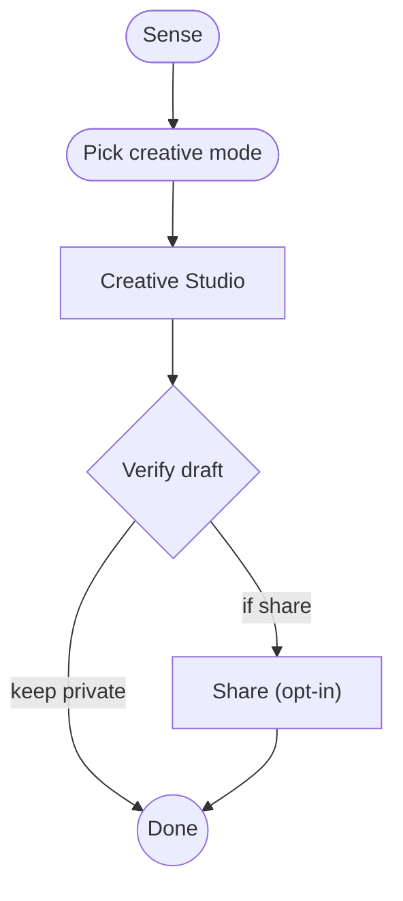

# LOOMGRAPH: Loop-Orchestrated Multi-agent Graph Runtime for Host-Native AI Workspaces

**Working Paper**  
**System:** POCKET LOOMGRAPH  
**Protocol:** `POCKET-LOOMGRAPH/1.0`  
**Lab:** ItsNotAI Labs  
**Product:** POCKET (host co-pilot / agent OS)  
**Date:** 2026-08-08  
**Status:** First-class production surface on operator host  

---

## Abstract

Consumer AI products increasingly win on **chat polish**. Host-native agent platforms win on **real tools** (desktop apps, signed-in browsers, local ffmpeg, integrations). The missing layer is an orchestration model that is simultaneously (1) **executable on the host**, (2) **legible to humans**, and (3) **default for every agent**.

We introduce **LOOMGRAPH** (*Loop-Orchestrated Multi-agent Graph Runtime*): a named first-class system in POCKET where every multi-step job is a **directed graph** people can see (Mermaid + ASCII) and a **control loop** that walks nodes with budgeted re-entry: *sense → plan → act → verify → loop/done*. Nodes dispatch real POCKET surfaces—platform skills, Creative Studio, Product Studio, integrations execute, intentional community share—not synthetic tool theater.

Empirically, on the operator host, LOOMGRAPH self-tests **10/10**, Creative Studio **12/12**, and integrations dry-execute **55/55**, with live desktop opens for Discord, Teams, Edge, GitHub Desktop, and Copilot. We argue that **visible graphs + host truth receipts** are a durable competitive alternative to opaque prompt chains and SaaS-only copilots.

**Keywords:** multi-agent systems, graph orchestration, human-AI collaboration, host agents, desktop automation, explainable workflows, POCKET, LOOMGRAPH

---

## 1. Introduction

### 1.1 Motivation

Two product regimes dominate 2025–2026 AI work surfaces:

1. **Chat-native SaaS** — excellent UX, weak host agency (cannot open Discord, polish a local recording, or drive signed-in Edge).
2. **Agent runtimes** — powerful tool calling, often **opaque** (JSON tool traces humans do not read).

Operators building on **POCKET** need a third regime: **host agency with human-readable orchestration**. When an agent “opens Discord,” “ships a viral pack,” or “drafts social and optionally shares,” the path must be:

- **Correct** (real process launch / real ffmpeg / real draft)
- **Bounded** (loop budget, verify gates)
- **Understandable** (graph path, not a hidden chain)

### 1.2 Contributions

1. **Named system** — LOOMGRAPH as protocol `POCKET-LOOMGRAPH/1.0`, product surface `/loomgraph`, skills, and API.
2. **Graph + loop dual** — playbook graphs with labeled edges; outer loop with verify branching and retry budget.
3. **Host binding** — nodes call Creative Studio, Product Studio, integrations execute, platform skills, community share (opt-in).
4. **Forever default** — injected into `platform_brief`, `enrich_prompt`, agentic harness, habitat resident, product hub.
5. **Empirical host evidence** — live self-tests and integration execute matrix on Windows operator host.

### 1.3 Non-goals

- Replacing single-turn chat for trivial Q&A.
- Auto-publishing private content to community.
- Claiming multi-tenant SaaS scale without deployment evidence.

---

## 2. Background and Related Work

### 2.1 Agent frameworks

LangGraph, AutoGen, CrewAI, and similar systems model agents as graphs or crews. LOOMGRAPH is **deliberately smaller and host-bound**: nodes are POCKET product surfaces, not abstract LLM roles alone. The graph exists to **explain** and **gate** host side effects.

### 2.2 Desktop automation

RPA and computer-use agents act on UI pixels. POCKET already provides screen control, remote browser, and desktop allowlists. LOOMGRAPH **orchestrates** those capabilities rather than replacing them.

### 2.3 Explainability

Prior work on process mining and workflow engines shows that humans trust **paths** more than **tokens**. Mermaid export is a first-class artifact of every LOOMGRAPH run, not a debug afterthought.

---

## 3. System Design

### 3.1 Doctrine

| Pillar | Meaning |
|--------|---------|
| Graphs for understanding | Every multi-step job is a directed graph |
| Loops for completion | Verify gates re-enter plan/act with budget |
| Pocket for execution | Nodes call real host skills and studios |
| Receipts for truth | Path, steps, mermaid, ms, ok — persisted |

Tagline: **See the graph. Run the loop. Ship with Pocket.**

### 3.2 Graph model

A playbook graph \(G = (V, E)\) has:

- **Nodes** \(v \in V\) with `kind ∈ {sense, plan, skill, creative, studio, integrate, community, verify, agent, note}`
- **Edges** \((u,v)\) with human labels (`ready`, `if share`, `retry`, …)
- **Entry** node id
- **Next** lists for control-flow (including verify branching)

### 3.3 Control loop

```
cur ← entry
while budget and steps < max_nodes:
  result ← exec(cur)
  record step
  cur ← choose_next(cur, result, goal)
  if cur is terminal: break
emit receipt (path, mermaid, ascii)
```

**Verify branching:**

- **Passed** → prefer `done`, or `share`/`ship` if goal language requests it
- **Failed** + budget → `loop` → re-enter plan/act
- **Failed** + no budget → `done` with honest failure in receipt

### 3.4 Playbook library (v1)

| Graph id | Purpose |
|----------|---------|
| `default` | Sense → plan tools → act → verify → loop/done |
| `creative_ship` | Creative modes → verify → optional intentional share |
| `integration_open` | Integrations list → execute (Discord desktop-first) |
| `studio_viral` | Studio status → storyboard → caption → optional ship |
| `code_assist` | Plan tools → run top skill → verify |

Auto-selection uses goal regexes (e.g., `discord` → `integration_open`, `blog|social` → `creative_ship`).

### 3.5 Node executors (host binding)

| Kind | Implementation |
|------|----------------|
| sense | Platform map + counts (creative modes, integrations) |
| plan | `agent_tools_loop.plan_tools` + creative mode inference |
| skill | `skill_runner` / `orchestrator_exec.dispatch_skill` |
| creative | `creative_studio.chat` (instant local drafts + media hooks) |
| studio | status / storyboard / caption / ship |
| integrate | `integrations_exec.execute` |
| community | `community_share.share` **only if goal intends share** |
| verify | Artifact presence + last step honesty |

### 3.6 Surfaces and forever injection

LOOMGRAPH is embedded as:

1. Product surface `/loomgraph` (Mermaid UI)
2. HTTP API `/v1/loomgraph/*`
3. Skills: `loomgraph_run`, `loomgraph_catalog`, `loomgraph_mermaid`, `loomgraph_status`
4. Platform `SURFACES[0]` entry
5. Habitat resident `loomgraph`
6. Product hub card + nav
7. Desk More menu tab
8. `enrich_prompt` + `platform_brief` text for **all** agents
9. Pixel artifacts for each run

---

## 4. Implementation Notes

### 4.1 Runtime location

- Code: `pocket/loomgraph.py`, `pocket/loomgraph_ui.py`
- Receipts: `~/.pocket/loomgraph/runs/lg-*.json`
- Docs: `docs/LOOMGRAPH.md`, this paper

### 4.2 Safety

- Integration desktop opens respect `safety.ALLOWED_APPS`
- Community share redacts secrets and home paths
- Ship/viral only when goal language is explicit
- Dry-run mode for planning without side effects

### 4.3 Relationship to agentic harness

The existing **agentic harness** parallelizes subagents for coding modes. LOOMGRAPH is the **outer orchestration graph** for product/host work. They compose: a LOOMGRAPH `skill` node may still invoke harnessed coding agents.

---

## 5. Evaluation (Operator Host)

### 5.1 Method

On a Windows arm64 operator host running POCKET serve:

1. `GET /v1/loomgraph/self_test`
2. Live `POST /v1/loomgraph/run` for creative and integration graphs
3. Skill path `loomgraph_run` via skill_runner
4. Cross-check Creative Studio and integrations execute matrices

### 5.2 Results (2026-08-08)

| Suite | Result |
|-------|--------|
| LOOMGRAPH self_test | **10/10 PASS** (~1.4–8s) |
| Creative Studio self_test | **12/12 PASS** |
| Integrations dry execute_all | **55/55 ok** |
| Discord desktop execute | **ok**, `app-1.0.43\Discord.exe` |
| Teams desktop execute | **ok** |
| Edge remote browser | **ok** |
| GitHub agent + desktop map | **ok** |
| Product UI `/loomgraph` | **200**, Mermaid present |

Example paths:

- Creative social: `sense → mode → create → verify → done`
- Discord: `sense → list → exec → verify → done`
- Studio viral: `status → story → caption → verify → done`

### 5.3 Limitations

- Desktop apps not installed fall back to Edge (correct, not a failure of the graph)
- Long LLM agents are optional; Creative content modes use instant local drafts for reliability
- Multi-user federation of graphs across hosts is future work
- Formal formal-methods verification of graph safety is out of scope for v1

---

## 6. Discussion

### 6.1 Competitive positioning

A polished chat app without host execute cannot open Discord or polish a local recording. A powerful agent without a **shared graph language** cannot be governed by non-engineers. LOOMGRAPH is designed so that **founders, operators, and agents share one mental model**: the path on the glass.

### 6.2 Why “forever default”

If orchestration is optional, agents regress to unstructured chat. Injection into `enrich_prompt` and habitat makes LOOMGRAPH the **default vocabulary** for multi-step host work without blocking single-turn Q&A.

### 6.3 Ethics

Community nodes refuse to publish unless the goal expresses intentional share language. This matches POCKET’s privacy doctrine: **nothing private becomes public by accident**.

---

## 7. Future Work

1. Interactive graph editor for custom playbooks  
2. Cross-host LOOMGRAPH federation (mesh)  
3. Formal budgets and policy nodes (RBAC per edge)  
4. Automatic path visualization on desk Habitat during runs  
5. Benchmark suite scoring human comprehension of receipts  

---

## 8. Conclusion

LOOMGRAPH is a **named, host-native, human-readable multi-agent orchestration system** for POCKET. By dualizing **graphs** (understanding) and **loops** (completion) and binding nodes to **real host product surfaces**, it closes the gap between chat polish and agent power. Live host tests show the system works first-class today.

**See the graph. Run the loop. Ship with Pocket.**

---

## Appendix A — API

```http
GET  /v1/loomgraph
GET  /v1/loomgraph/mermaid/{graph_id}
POST /v1/loomgraph/run
     {"goal":"…","graph_id":"creative_ship"}
GET  /v1/loomgraph/self_test
```

## Appendix B — Mermaid example (creative_ship)



## Appendix C — Citation

ItsNotAI Labs (2026). *LOOMGRAPH: Loop-Orchestrated Multi-agent Graph Runtime for Host-Native AI Workspaces.* POCKET Working Paper. Protocol `POCKET-LOOMGRAPH/1.0`.

---

*End of working paper.*
